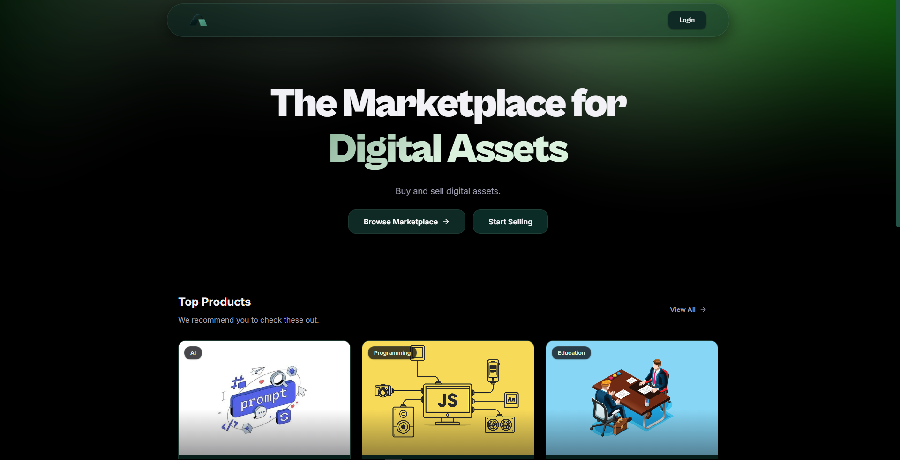

# FileMerch

A full-stack digital marketplace built with the MERN stack where creators can upload, sell, purchase, and securely download digital products such as notes, templates, cheat sheets, and other digital resources.

## Screenshot

## Live Demo

🔗 https://filemerch.vercel.app

## Features

- Google OAuth Authentication
- Seller Registration & Public Profiles
- Digital Product Marketplace
- Product Upload & Management
- Secure File Storage
- Product Search & Categories
- Purchase Library
- Secure File Downloads
- Product Reviews & Ratings
- Responsive User Interface

## Tech Stack

### Frontend

- React
- Vite
- Vanilla CSS
- Axios
- React Router
- React Hot Toast

### Backend

- Node.js
- Express.js
- Passport.js
- Google OAuth 2.0
- JWT
- Multer
- CORS

### Database

- MongoDB
- Mongoose

### Storage

- Supabase Storage

### Payment

- Razorpay

### Deployment

- Vercel
- Render

## Learning Outcomes

- Designing scalable MongoDB schemas
- Building RESTful APIs with Express.js
- Implementing Google OAuth authentication with JWT and HTTP-only cookies
- Building role-based authorization
- Secure file upload and storage
- Generating signed URLs for protected downloads
- Structuring scalable MERN applications
- Managing global state with React Context API
- Deploying full-stack applications to production
